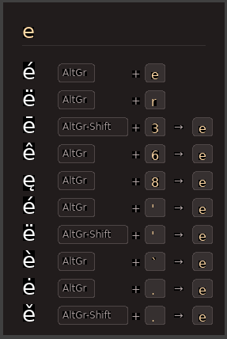

# kbdviz - Keyboard Character Reference Tool

A lightweight Wayland overlay that helps you discover how to type special characters (like ë, é, ñ, å) using your keyboard layout.



## Features

- **Layout-Aware**: Reads your actual keyboard layout from the Wayland compositor
- **Dead Key Support**: Shows sequences like `AltGr-'  e` for é
- **Fast Lookup**: Type a base character to see all variants with their key combinations
- **Unobtrusive**: Layer-shell overlay that can be quickly shown and dismissed

## Installation

### Debian/Ubuntu

Build and install a .deb package:

```bash
cargo install cargo-deb
cargo deb
sudo dpkg -i target/debian/kbdviz_*.deb
```

### Other Linux Distributions

Build and install the binary:

```bash
cargo build --release
sudo cp target/release/kbdviz /usr/local/bin/
```

### Requirements

- Rust 1.70+ (for building)
- Wayland compositor with layer-shell support
- libxkbcommon

## Usage

Run `kbdviz` from a terminal or bind it to a key in your compositor.

1. Type a letter (e.g., `e`, `a`, `o`)
2. See all variants with their key combinations
3. Press **ESC** to close

### Example

Type `e` to see:
```
é    AltGr    '
è    AltGr    `  e
ë    AltGr    "  e
ê    AltGr    ^  e
€    AltGr    5
```

The display shows:
- **Character** (large, on the left)
- **Modifier** (AltGr, AltGr-Shift)
- **Key(s)** to press

For dead key sequences, two keys are shown (e.g., `` ` `` then `e`).

## How It Works

kbdviz receives your keyboard layout from the Wayland compositor and scans all AltGr and AltGr+Shift combinations to build an index of special characters. It also detects dead keys and shows their possible completions.

Characters are indexed by their base letter using Unicode NFD decomposition (é → e), so typing `e` shows all e-variants.

## Project Structure

```
kbdviz/
├── Cargo.toml
└── src/
    ├── main.rs       # Wayland app, event loop, keyboard handling
    ├── keyboard.rs   # XKB keymap wrapper
    ├── compose.rs    # Character index builder
    └── ui.rs         # Rendering with tiny-skia + cosmic-text
```

## Configuration

### Keyboard Shortcut

Add a keybind to quickly launch kbdviz. For niri, add to your config:

```kdl
binds {
    Mod+Shift+K { spawn "kbdviz"; }
}
```

For sway:

```
bindsym $mod+Shift+k exec kbdviz
```

### Keyboard Layout

The tool automatically uses your system's keyboard layout. To use a layout with AltGr combinations (recommended), configure your compositor. For example, in niri:

```kdl
input {
    keyboard {
        xkb {
            layout "us"
            variant "altgr-intl"
        }
    }
}
```

## Dependencies

- `smithay-client-toolkit` - Wayland layer-shell
- `tiny-skia` - 2D graphics
- `cosmic-text` - Text rendering
- `xkbcommon` - Keyboard layout parsing
- `unicode-normalization` - Base character detection

## License

MIT
